# Challenge 1 - Dynamic Programming

Environments: 
 * Pendulum-v0
 * Qube-v0

## Learning the Dynamics and Rewards

We tested out different model types for learning the dynamics and rewards

### Random Forest

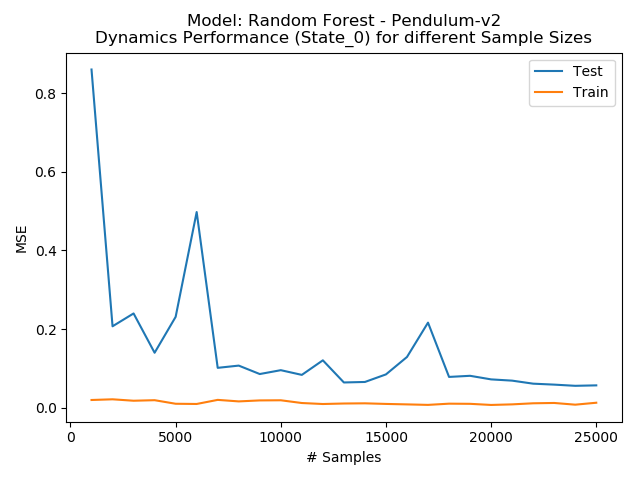
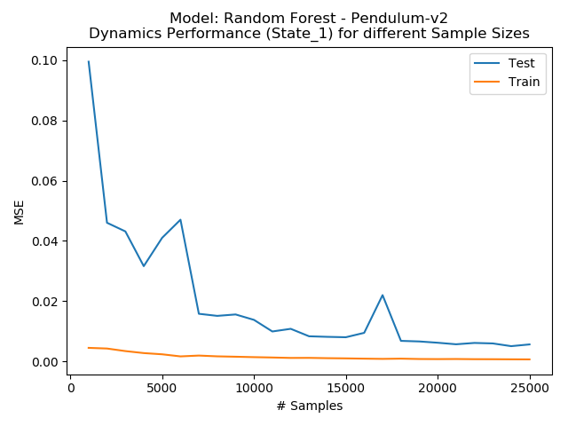
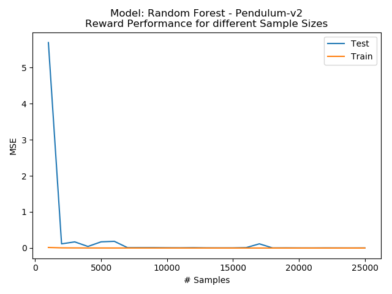

### Gaussian Process

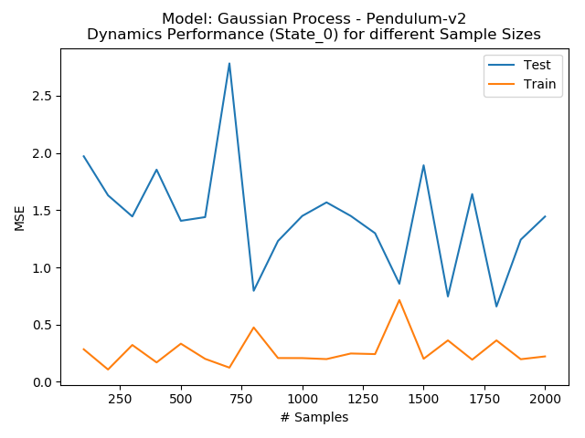
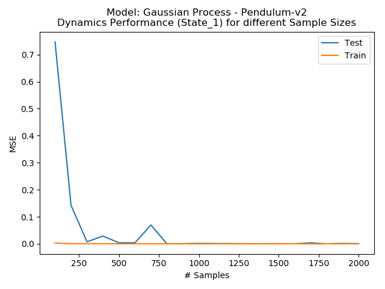
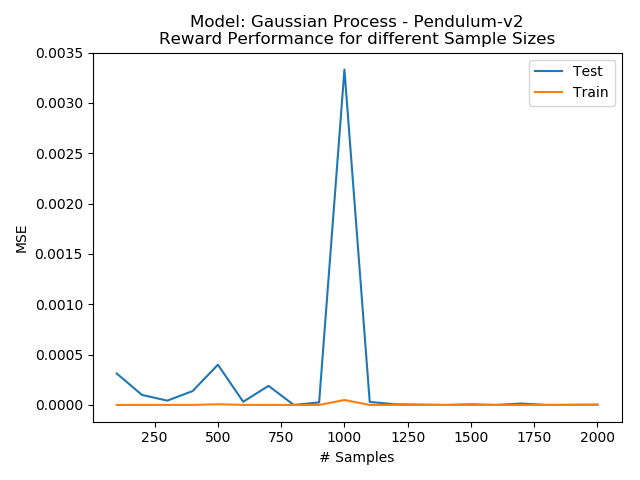

### Neural Network

Later on we switched to using a Multi Layer Perceptron with the following architecture:
* 3 hidden layers each having 200 units
* 2 Dropout Layers with 30% rate between last after 2nd and third hidden layer

We use RMSProp as the optimizer with learning rate of `1e-3` and train for 150 epochs.
The learning rate is reduced by factor of 2 every 50 epochs.
All available sample 10,000 sample for Pendulum-v0 are used.
Training both networks takes about 3 minutes.
After training the network weights are stored and can be reloaded via `load_model = True` in 
[challenge1.py](challenge1.py#L36).

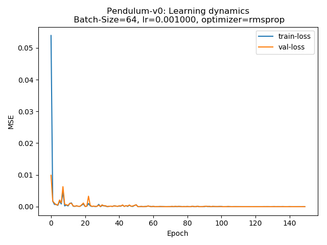
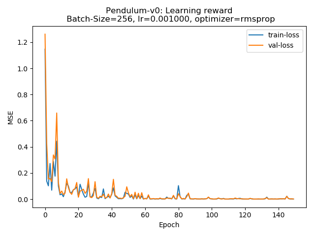


## Finding the right bin sizes
One important detail is that two bins are sufficient for the action range for solving the Pendulum-v0.
For the other features we enable to have different number of bins per feature and different support possible dense locations of the bins:

* equal: equal sized bins
* center: More bins at the center of the feature space
* edge: More bins at the edges of the feature space
* start: Most bins are a the start of the feature space
* end: Most bins are the end of the feature space

### Comparision of different dense locations for the bins

| Dense Location | #Bins Theta | #Bins Theta Dot | MC_samples | Avg Reward over 100 episodes| Value Iterations |
|:---|:---:|:---:|:---:|:---:|:---:|
|equal | 100 | 100 | 100 | -146.732 | 100 |
| center |  100 | 100 | 100 | -143.784 | 100 |
| edge |  100 | 100 | 100 |-148.942 | 100 |
| start |  100 | 100 | 100 | -148.317 | 100 |
| end | 100 | 100 | 100 | -148.380 | 100 |

There's a scaling parameter which defines how much bigger the bins are growing in size in respect to the dense region.
For the pendulum more bins at the center leads to better results because this helps balancing.

# Pendulum-v0

The runtime of the full script including training the Neural Networks and executing the value iteration takes 5 minutes and 12 seconds.
 
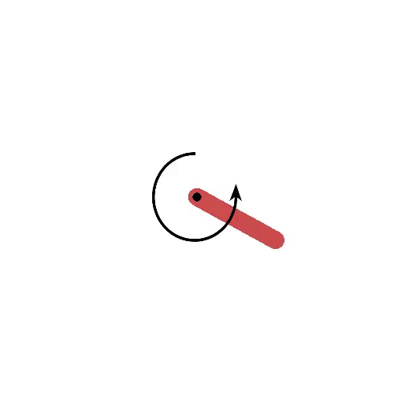


## Value Iteration
* Result for 100 bins which are more dense in the center for both features: 

### Iteration 0
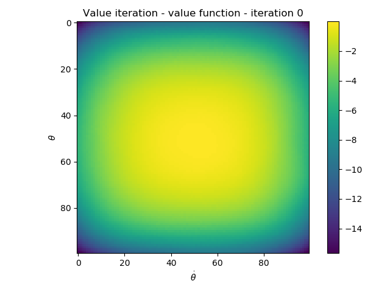
### Iteration 15
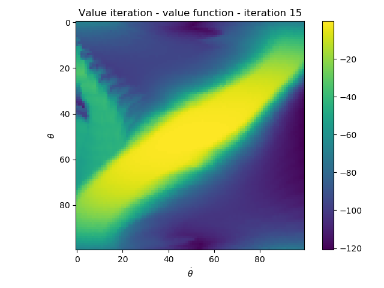
### Final Iteration


### Resulting Policy
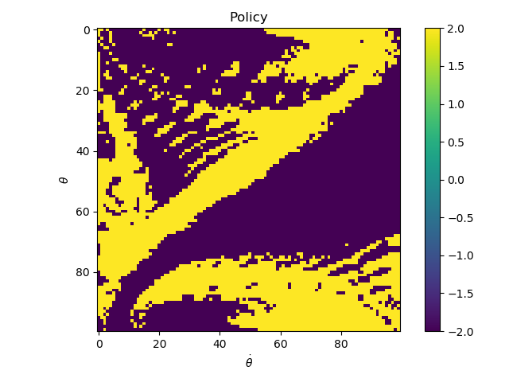

Result for Pendulum-v0
`average reward over 100 episodes: -143.784 +- 77.080 min: -372.172 max: -1.730`

The policy is saved in [policy_VI_Pendulum-v0.npy](./Export/Pendulum/ValueIteration/policies/policy_VI_Pendulum-v0.npy).

## Policy Iteration
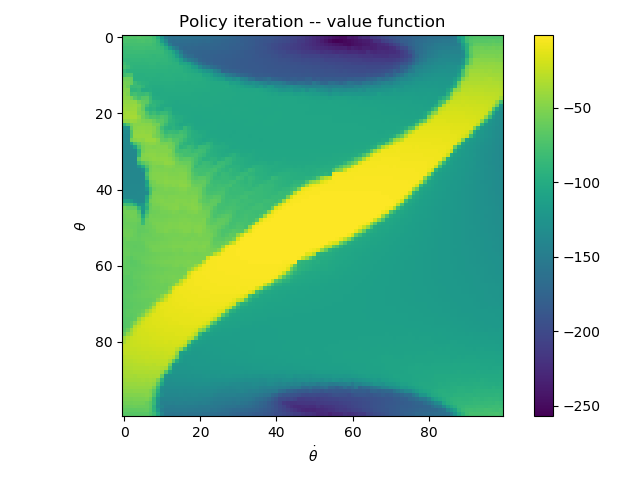
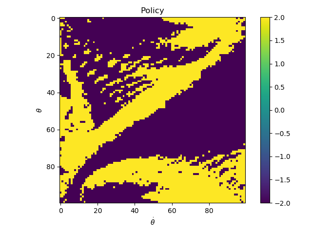

```python
bins_state = [100, 100]
dense_location = ["center", "center"]
high = [np.pi, 8]
low = [-np.pi, -8]
MC_samples = 100
```
`average reward over 100 episodes: -149.038 +- 79.486 min: -356.445 max: -2.943`

The policy is saved in [policy_VI_Pendulum-v0.npy](./Export/Pendulum/PolicyIteration/policies/policy_PI_Pendulum-v0.npy).

### Distribution over states using Monte Carlo Sampling

We tried both normal and uniform distributions over monte carlo samples.
Monte Sampling enables smoothing and leads to a more robust and stable policy with the cost of additional computational time.
A more runtime efficient approach is to use deterministic monte carlo sampling without any distributions by computing the average over state.
This gives better result on lower quality dynamics and reward models without utilizing distributions.

 # Qube-v0
 
 For changing to Qube-v0 you must set `env_name = 'Qube-v0'` in [challenge1_checker.py](challenge1_checker.py#L18).
  
 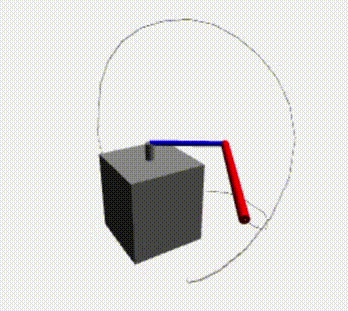

 Taking large action ranges leads to invalid states because Dynamic Programming can't take this into account by default.
 Therefore we are using the Qube-v0 environment of the challenge branch of the quanser robot repository.
 Using Monte Carlo sampling improves leads to higher computational cost, therefore one must find trade-off number of bins and number of samples. 

 ```python
 bins_state = [11, 88, 33, 44]
dense_location = ["equal", "equal", "equal", "equal"]
high = [2, np.pi, 30, 40]
low = [-2, -np.pi,  -30, -40]
MC_samples = 1
```
 `average reward over 100 episodes: -35.574 +- 3.156 min: -44.248 max: -26.066`
 
 The policy is saved at: [policy_VI_Qube-v0.npy](./Export/Qube/policies/policy_VI_Qube-v0.npy)
 
 
 By using a random search we get a reward of `-22.51` over first 100 epochs on a fixed seed value:
 
   ```python
 bins_state = [48 80 54 18]
dense_location = ["edge", "edge", "edge", "edge"]
high = [2, np.pi, 30, 40]
low = [-2, -np.pi,  -30, -40]
MC_samples = 1
```
  
 
 ## Filtering th Policy
 ### Median Filter & Gaussian Smoothing
 
 If we a have an ok policy it's beneficial to apply a median filter to reduce noise.
 For a very good policy applying a median filter on the policy matrix doesn't give any benefits.
 
