### Challenge 1

We tested out different model types for learning the dynamics and rewards

## Random Forest

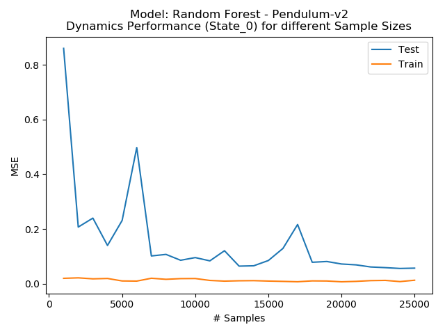
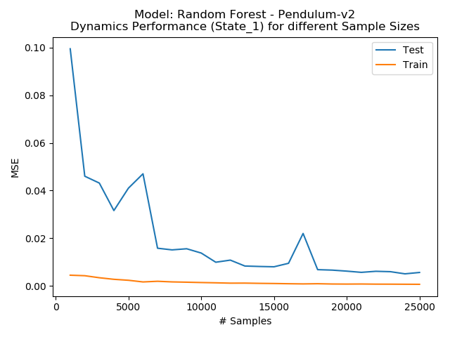
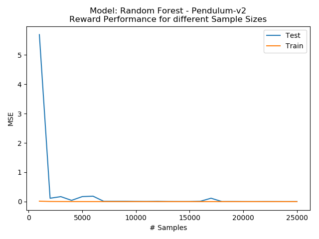

## Gaussian Process

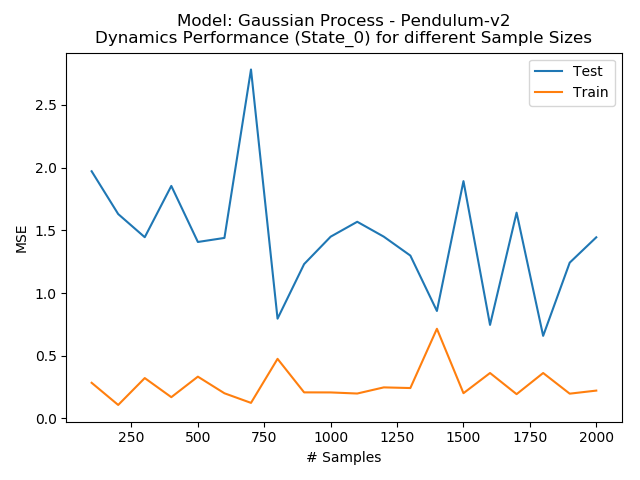
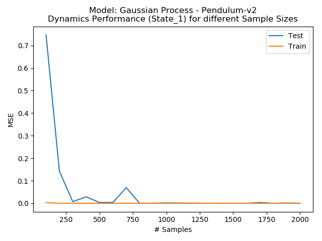
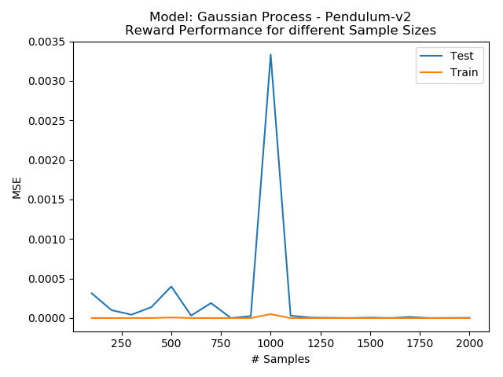

## Neural Network

Later on we switched to using a Multi Layer Perceptron with the following architecture:
* 3 hidden layers each having 200 units
* 2 Dropout Layers with 30% rate between last after 2nd and third hidden layer

## Value Iteration
* Result for 200 equal sized bins for both features: 

* X axis: theta dot
* Y axis: theta
### Iteration 0
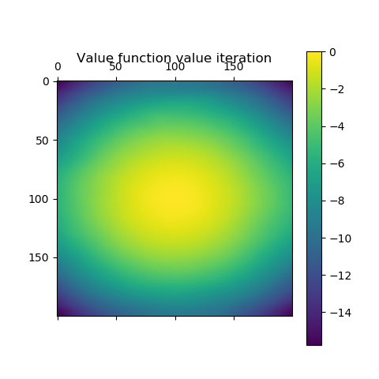
### Iteration 15
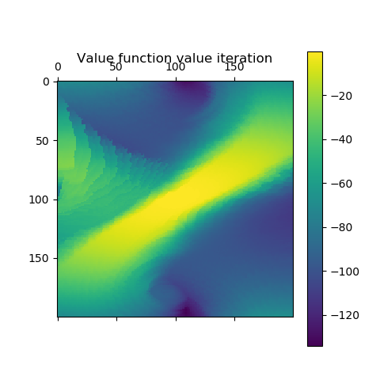
### Final Iteration 15

### Resulting Policy
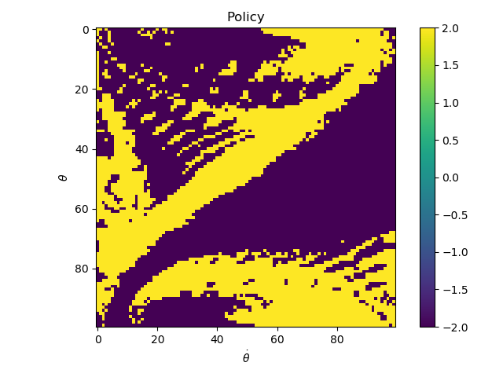

Best results for Pendulum-v2
`100 epochs: Mean reward: -147.71839019523438 -- standard deviation of rewards: 100.89982163365936`

## Policy Iteration
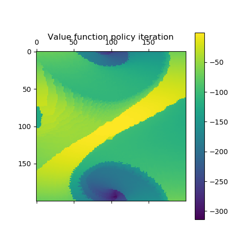
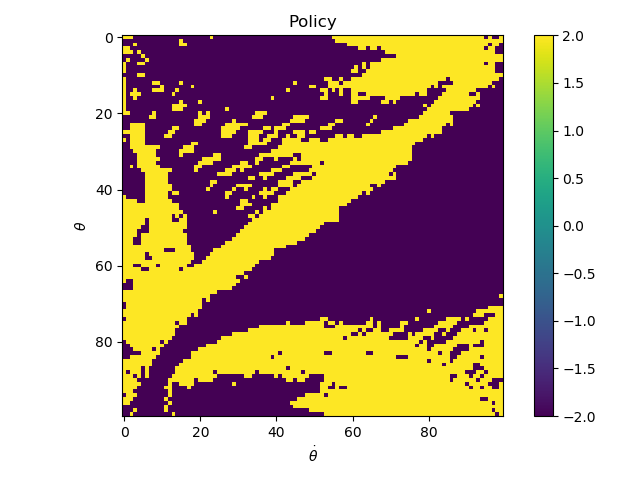

[Sourcecode](./main.py#L10)

We found out that if we have a good dynmaic model then it's better to use more bins in the center because
 this helps balaning. 