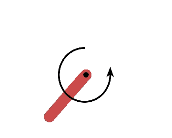
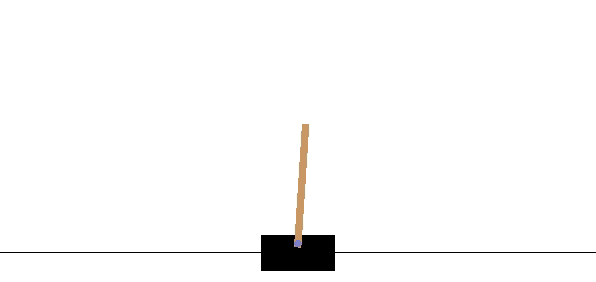

# Challenge 2

Authors: Jannis Weil, Johannes Czech, Fabian Otto

## Least-Squares Policy Iteration (LSPI)

In this section, we describe our experience with implementing LSPI based on the paper from [Lagoudakis & Parr](http://jmlr.csail.mit.edu/papers/v4/lagoudakis03a.html).

Our main focus for the implementation is the environment `CartpoleStabShort-v0` from the [Quanser platform](https://git.ias.informatik.tu-darmstadt.de/quanser/clients).

### Implementation and observations

The implementation can be found in the python module `Challenge_2.LSPI`.

We implemented LSPI as offline algorithm and do not sample any new samples during the optimization. We found for the `CartpoleStabShort-v0` environemnt, random actions can cover the state space reasonably well and adding new samples do not increase the performance. Additionally, we always use all 25,000 samples furing our update. Utlizing batches of smaller sizes (128, 512, 1024, 2048) always yieled in worse results. 

#### Discretization of actions
For the discretization of actions we decided to use [-5, 0, +5], this allows the cartpole to maintain its upright postition by choosing action [0]. Removing [0] from the possible actions highly reduced the performance for us. We assume this happends due to the need to select going to the left and right, which are both equaly good/bad at the fully upright position, i.e. the algorithm is harming its own performance as both action lead to worst states.

#### Feature functions
Finding a good feature function is the key challenge of LSPI. The algorithm itself does not require a lot of complex computation, the main part can be found in the LSTDQ-Model (see below). Therefor, finding a good feature function decides over success and failure. We implemented RBF features as well as Fourier Features (both can be found in`Challenge_2.LSPI.BasisFunctions`).
During our tests, the Fourier features worked significantly better and we were not able to learn a consitent policy with RBF features. 
One reason for this is, in our opinion, the large hyperparameter space for RBFs. It is necessary to tune the RBF centers as well as the length scales. 
We tested two types similar types of Fourier features. 
The [first implementation](http://papers.nips.cc/paper/3182-random-features-for-large-scale-kernel-machines.pdf)
$f(\mathbf{x}) \equiv \sqrt{\frac{D}{2}}[\cos(\omega_1^T\mathbf{x}+b_1),\ldots,\cos(\omega_D^T\mathbf{x}+b_D)]$
 performed in our experience worse than the [second](http://papers.nips.cc/paper/7233-towards-generalization-and-simplicity-in-continuous-control.pdf)
$f(\mathbf{x}) \equiv \left[\sin\left(\frac{\omega_{1}^T\mathbf{x}}{v} + \phi^{(1)}\right),\ldots,\sin\left(\frac{\omega_{D}^T\mathbf{x}}{v} + \phi^{(D)}\right)\right]$
with
$\omega \sim \mathcal{N}(0,1); b \sim U[0,2\pi); \phi \sim U[-\pi,\pi)$
<!-- p(\omega) = (2\pi)^{-\frac{D}{2}} e^{\frac{\lVert\omega\rVert_2^2}{2}} -->

Fourier features have the advantage that they approximate the RBF kernel as described in the above papers while also limiting the need for a lot of hyperparameter tuning. Besides the amount of features $D$ and the band width $v$ in the second version, the hyperparameters are "fixed". 
Further, we found that combining the second fourier features with min-max normalization (`Challenge2.Common.MinMaxScaler`) was improving the results siginificanlty from approximately 500 reward to 10,000 reward for the `CartpoleStabShort-v0` environment. In order to normalize $\dot x$ and $\dot \theta$, which have infinte state boundaries, we selected empirically choosen max and min values (based on samples), [-4,4] for $\dot x$ and [-20,20]  for $\dot \theta$.
Even though we observed slightly lower $\dot \theta$ in the samples, increasing the range helped, we assume some extreme cases were simply not covered by the random inital actions.

#### Issues
As mentioned above finding an appropriate feature function was the hardest part. The final result we found was, honestly, slightly lucky. Implementing the LSPI itself was straitforward and as long as we used the normal LSTDQ-model, matrix computations were possible. However, the optimized LSTDQ version was not fast. Even though the optimized version avoids computing the inverse of $A$, it depends on the approximate inverse of $A$, which is computed iteratively from the previous sample and therefore makes it necessary to use loops in the computation. Consequently, the higher performance matrix computations in C cannot be used. 
Additionally, as before mentioned, normalization played a key role for good results, without it we often experienced that LSPI is not converging.
On big remaining issue is that our policy cannot be exactly reproduced with a different seed, as a change of the seed does not only change the samples but also the $\omega$ and $\phi$ parameters of the fourier features. However, we get more stable results over multiple seeds when we are using more training samples.

### Results

Using the above setting we achieve a reward of 19,999.95 over 10,000 steps and 25 different seeds for the test run.
  [GIF]

## Deep Q-Learning (DQN)

In this section, we describe our experience with implementing DQN based on [Deepmind's paper](https://storage.googleapis.com/deepmind-media/dqn/DQNNaturePaper.pdf).

DQN was tested out on the `CartpoleSwingShort-v0` environment form the [Quanser platform](https://git.ias.informatik.tu-darmstadt.de/quanser/clients). Additionally, we created a model for the classic `Pendulum-v0` [environment](https://gym.openai.com/envs/Pendulum-v0/).

### Implementation and observations

The implementation can be found in the python module `Challenge_2.DQN`.

#### Model type (experiments with different architectures)

As suggested in the paper, we use neural networks for our models. We tried using deep networks, but according to early experiments it seems like shallow network architectures work better in our case. We experimented with different networks using 1 to 3 hidden layers with a small amount of hidden notes between 15 and 64. We also tried different activation functions but setteled down with ReLU, as we were able to achieve very good results on the pendulum with it. Fancy techniques such a Batch-Normalization-Layers lead to worse results.

#### Replay Memory and Exploration
Our replay memory stores each observed sample up to the specified capacity, then it starts to overwrite old samples.
<!--`self.memory.push((*obs, *action_idx, reward, *next_obs, done))` -->
We choose the actions during the online-learning process based on an epsilon-greedy policy. For the training process, we implemented an exponetially decreasing epsilon starting from 100% random actions and ending with 1% random actions. This encourages exploration at the beginning and sticks to the learned policy at the end.
For the hyperparameters it appeared to be useful to use a rather large memory size (e.g. 1 million) and a high `minibatch_size` (e.g. 1024). This might be to avoid a high correlation between the training samples.

#### Stability
One major problem we encountered with DQN is the stability of the learned policy. We often saw quite good policies being directly followed by policies where the cart just drives to one of the borders of the track as fast as it can.

We came up with the following strategies to improve the stability of the learned model:

* Use more steps before updating the target Q model.
* Use actions with lower values. E.g. `[-5, +5]` instead of `[-24, +24]`. When using high values, the agent often learns a sucidal policy where it crashes into the wall very quickly.
* Use reward shaping (e.g. punishing when the agent comes close to the border). **As this is not allowed for the challenge, we disabled this featue for the submission** and did no further investigations. However, early experiments suggest that it is much easier to learn a good policy with reward shaping. This indicates that the environment `CartpoleSwingShort-v0` is designed suboptimally by enabling suicidal policies as a local optimum.

* #### Learning Rate Schedule
   We tried different learning rate schedules like `StepLR` which reduces the learning rate by a given factor at each timestep, as well as `CosineAnnealingLR` which smoothly lowers the learning rate. Although these learning schedules are often beneficial in the supervised case we didn't notice any improvements when using them in this RL-problem.

Using all these techniques, we are still not able to achieve a totally stable policy for `CartpoleSwingShort-v0`, meaning that it does not change much in further training episodes (except for directly running into the wall, this policy is quite stable). However, we can still extract the policies from the learning process which performed well.

### Results

Learning
[Plot of loss curve]

[Plot of average reward development]

<!-- Haben wir eine policy für den Stab task???? 
    Jannis: Nicht dass ich wüsste, das hatte ich nur irgendwann mal ausprobiert und es hatte damals ok geklappt. Aber war lange nicht so gut wie unser LSPI.
-->

#### Pendulum-v0
We tested the `Pendulum-v0` environment first to make sure that our implementation of DQN itself works. We were able to achieve a very good policy with an average reward of about -135 in a short period of training time (100 episodes):

#### CartpoleSwingShort-v0
For the cartpole swingup, we achieve a "propeller policy" for which the cart stays inside the boundaries of the track and spins the pole in circles. Using this strategy, the policy gets an average reward of **????**.

Clearly, this policy is not optimal. We experimented a lot and were able to create single runs with higher reward (~ 13k) but we were not able to reproduce these results with a single model. This could be caused by the fact that the update frequency of the target Q network is too low (under the length of one episode) and therefore the performance of a single training episode depends on multiple targets. ==Unfortunately, using higher update frequencies did not work????==
